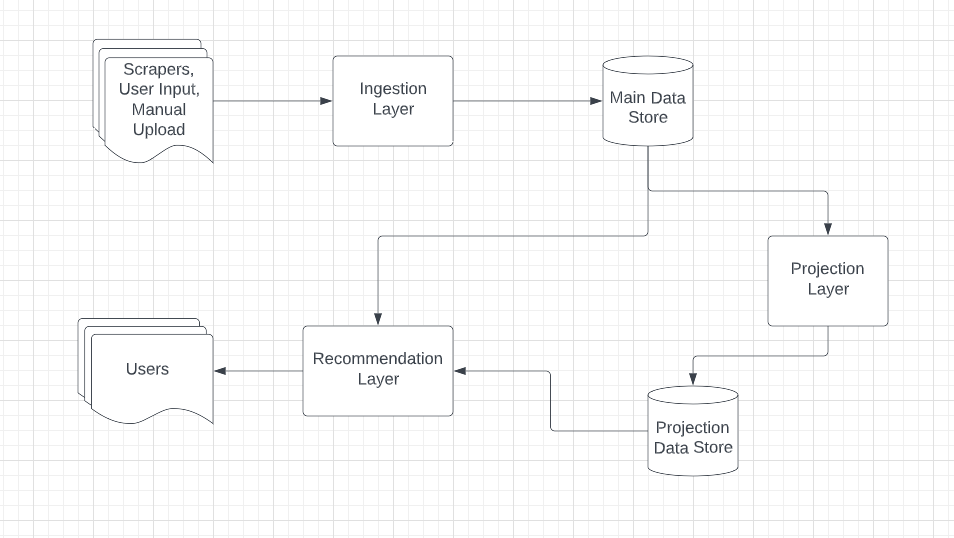

# reviewers-like-you
Steven Krawczyk, Isaac Malsky

July 2022

[Design doc](https://docs.google.com/document/d/1sPTaOpxOl5q8VmGsr-TLnwGrpLGtXugPjhlEqxvhL1Q/edit)

[Runbook](https://docs.google.com/document/d/1PVQZQyA8hbLpeZnJOZMJi2J8mLf0H-ztqKgS7Fe_sO4/edit)

[Discord server](https://discord.com/channels/1001211644745109537/1001211645252616224)

## Getting started

### Setup environment

#### Python

Make sure you already have python3 and pip3 installed. Then run the following commands
1. `pip install --upgrade pip` (or `pip3 install --upgrade pip`)
2. `pip install virtualenv` (or `pip3 install virtualenv`)
3. `virtualenv reviewers-like-you-venv`
4. `source reviewers-like-you-venv/bin/activate`
5. `pip install -r requirements.txt`

Now you have a virtual environment for running our python code. You will need to activate it by running `source reviewers-like-you-venv/bin/activate` whenever you want to develop in this repo.

#### Docker

Make sure you have docker installed and setup. You will need to build our base image before you can launch the backend containers. Run `docker build --no-cache --tag reviewers-like-you .`. This process will take a while, because we have to build and install some large dependencies. Fortunately, you should only have to do this once, unless our python dependencies or other base image requirements change.

#### React

You'll need `npm` and/or `yarn` to work with the react app. You can learn more in `app/frontend/README.md`. Our app was setup using [this tool](https://github.com/facebook/create-react-app).

### Tests

#### Unit and integration tests

Try some tests by running `python -m unittest tests.test_pipeline_in_memory` from the root dir of this repo, or run all tests by running `./tests/run_tests.sh`.

#### Load testing

We use [locust](https://docs.locust.io/en/stable/what-is-locust.html) for load testing. Try `./tests/load_test.sh` to run a load test and check out the results in `data/metrics/locust/perf`

### Jupyter notebook

Check out `notebooks/DataPipelineDemo.ipynb` for an overview and demonstration of our backend data processing

### Running the local website

1. Launch docker containers with our databases and web APIs by running `docker compose up -d`
2. Create a dynamodb table with `python -m tools.manage_table create movie_reviews`
3. Populate the DynamoDb table with data using `python -m tools.upload_data tests/test_data.csv`
4. Create a projection to use with `python -m tools.create_projection`
5. To run the react app: with the docker containers running, `cd` into the `app/frontend` dir and run `yarn start`. It will open a web page. For troubleshooting with the frontend, look at the `README.md` in that dir.

### Submitting changes

1. Before you get started, run either `cp -R hooks/ .git/hooks` or `git config core.hooksPath hooks/` to set up the `pre-push` git hook, which will make sure all tests are passing locally before pushing your changes to remote.
2. Make your changes and test locally, using `./tests/run_tests.sh`, as well as load testing and manual testing with the local website.
3. Commit your changes to a feature branch (not `main`) and push it.
4. Follow the steps below to create a github PR from your branch:  
 * https://docs.github.com/en/pull-requests/collaborating-with-pull-requests/proposing-changes-to-your-work-with-pull-requests/creating-a-pull-request

